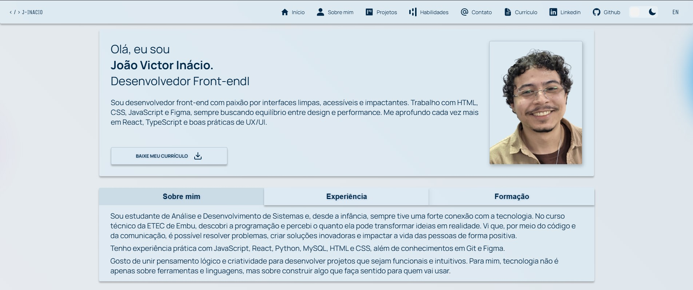

# Meu Portfólio Pessoal

> Meu portfólio de desenvolvedor.

**[Acesse a versão ao vivo aqui!](https://portfolio-joao-victor-inacio.vercel.app/)**

---
## 📜 Sobre o Projeto
Este projeto é a minha vitrine profissional como desenvolvedor front-end. O objetivo foi criar uma experiência de usuário agradável e ao mesmo tempo manter minha identidade visual, me inspirando na estética glassmorphism e utilizando CSS e React para apresentar meus projetos, habilidades e trajetória. A aplicação foi desenvolvida com foco em mostrar quem eu sou como profissional desenvolvedor.

---

## ✨ Features Principais

* **🎨 Tema Dinâmico:** Switcher para alternar entre os temas **Claro (Light)** e **Escuro (Dark)**, com todas as cores gerenciadas via variáveis CSS.
* **🌐 Suporte a Múltiplos Idiomas:** Totalmente traduzido para Português e Inglês usando a biblioteca **i18next**.
---

## 🛠️ Tecnologias Utilizadas

Este projeto foi construído utilizando as seguintes tecnologias e bibliotecas:

* **Core:** React.js, Vite
* **Estilização:** CSS Modules, Variáveis CSS para Theming
* **Animação:** `react-type-animation`, `react-intersection-observer` (via custom hook)
* **Navegação:** `react-scroll`
* **Internacionalização:** `react-i18next`, `i18next-http-backend`
* **Ícones:** `react-icons`

---
